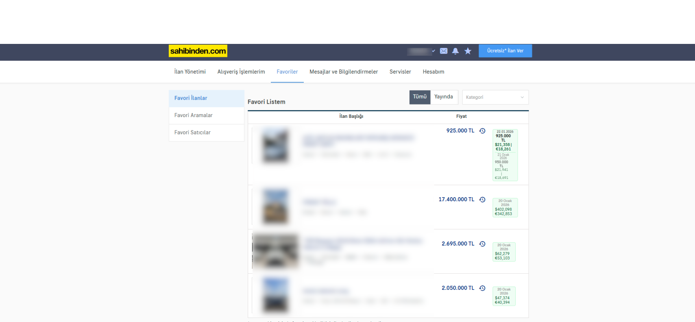

# Sahibinden Döviz Takipçisi / Currency Tracker for Sahibinden

## 🇹🇷 Türkçe

**Sahibinden Döviz Takipçisi**, `sahibinden.com` üzerindeki favori ilanlarınızın fiyatlarını döviz (Dolar ve Euro) bazında takip etmenizi sağlayan bir Chrome eklentisidir. İlan favoriye eklendiği günkü kur ile bugünkü kur arasındaki farkı görmenize yardımcı olur.

### Özellikler
*   **Otomatik Döviz Hesabı:** İlanın eklendiği tarihteki (veya tespit edilen) fiyatı Dolar ve Euro'ya çevirir.
*   **Fiyat Tarihçesi:** Fiyat değişikliklerini (düşüşleri) kaydeder ve gösterir.
*   **Geçmiş Senkronizasyonu:** "Fiyat Tarihçesi" sayfasını ziyaret ettiğinizde, ilanın orijinal eklendiği tarihi ve fiyatı otomatik olarak hafızaya alır.
*   **Otomatik Takip:** Favoriler sayfasını ziyaret ettiğinizde listedeki ilanları otomatik olarak takibe alır.
*   **Pasif İlan Kontrolü:** Yayından kalkan veya satılan ilanları tespit eder ve "PASİF" olarak işaretler.
*   **Anlık Güncelleme:** Veriler güncellendiğinde sayfayı yenilemeye gerek kalmadan rozetler anında güncellenir.

### Kurulum
1.  Bu projeyi indirin veya kopyalayın.
2.  Chrome tarayıcısında `chrome://extensions` adresine gidin.
3.  Sağ üstteki **Geliştirici Modu**'nu açın.
4.  **Paketlenmemiş öğe yükle** butonuna tıklayın ve proje klasörünü seçin.

---

## 🇬🇧 English

**Sahibinden Currency Tracker** is a Chrome extension that allows you to track the prices of your favorite listings on `sahibinden.com` in foreign currencies (USD and EUR). It helps you see the value difference based on the exchange rate from the day the listing was added versus today.

### Features
*   **Auto Currency Conversion:** Converts the listing price to USD and EUR based on the historical or current rate.
*   **Price History:** Tracks and displays price drops over time.
*   **History Sync:** Automatically retro-syncs the *original* add date and price when you visit the listing's "Price History" page.
*   **Auto-Track:** Automatically adds listings to the database when you scroll through your Favorites page.
*   **Inactive Listing Detection:** Detects removed or sold listings and marks them as "INACTIVE".
*   **Real-Time Updates:** Badges update instantly without page reload when data changes.

### Installation
1.  Download or clone this repository.
2.  Go to `chrome://extensions` in your Chrome browser.
3.  Enable **Developer Mode** in the top right.
4.  Click **Load unpacked** and select the project folder.
